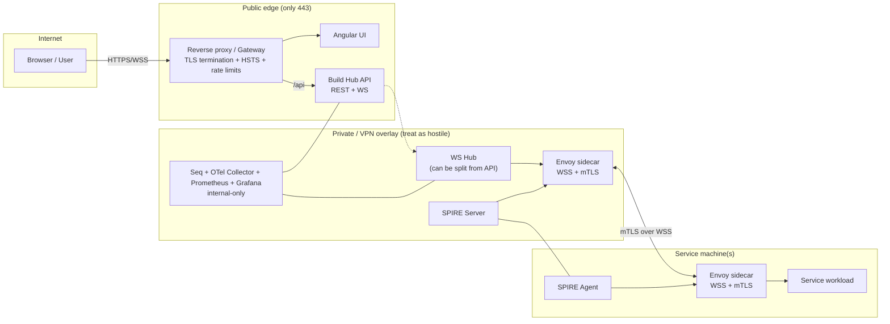
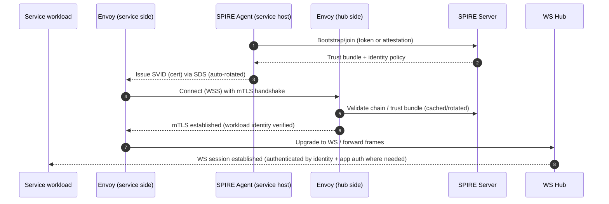

# ADR-0007: Secure communications (UI ↔ API ↔ Services) and transport hardening

- **Status:** Accepted (iterative; revisit when moving to OAuth / dedicated Auth service)
- **Date:** 2026-02-15
- **Decision owners:** Build Hub team
- **Related:** Architecture & services docs; Observability stack (OTel, Prometheus, Grafana); Token-based auth roadmap.

## Context

Build Hub is designed as:

- **Angular UI** communicating to **Build Hub API** via **HTTPS + WebSockets (WSS)**.
- **Services** (build/execution-related) will run on **different machines** and communicate using **WebSockets**, with the **services initiating the connection** to the API (and potentially a dedicated **WS Hub** in the future).
- Current deployment approach is **Docker** (Windows now, potentially Linux later).

Threat model / goals:

- Prevent **MITM** on any traffic that crosses a network boundary.
- Avoid exposing internal services/admin tooling to the public internet.
- Provide “enterprise-grade” workload identity and **automatic key rotation** (avoid manual certificate handling).
- Keep future **WS Hub split** easy (API and Hub can separate without breaking service connectivity). 

## Decision

### 1) Internet edge (Browser UI ↔ API)

**Use a reverse proxy / gateway as the only public entrypoint**:

- Expose **only port 443** publicly.
- Enforce **HTTPS + WSS only** (no plaintext HTTP/WS).
- Apply gateway controls: **HSTS**, **rate limiting**, and basic “WAF-ish” request filtering where practical.

**WebSocket hardening (browser)**:

- Validate **Origin** on every WebSocket handshake (allowlist) to reduce cross-site WebSocket abuse patterns.
- Require authentication at handshake (Bearer token) and treat WS connections as short-lived:
  - when access token expires, **close** and **reconnect** with a new token (don’t attempt “refresh within the same socket”).

**Identity**:

- Browser → API uses standard token auth (JWT). Recommended “enterprise SPA” login pattern is **OIDC Authorization Code + PKCE**.
- Note: **browser mTLS** is not considered reliable/practical; we rely on TLS + correct certs + HSTS at the edge.

### 2) Cross-machine backend traffic (Services ↔ WS Hub)

Treat the network as hostile (even if “same LAN”), and design for **public-network safety**:

- Prefer a **private overlay network / VPN** (WireGuard / Tailscale / site-to-site) when traffic may traverse public networks.
- Enforce **mTLS** for service-to-hub connectivity, using **workload identity** with automatic rotation:
  - **SPIFFE/SPIRE** for identity issuance.
  - **Envoy sidecars** in front of the WS Hub and each Service; Envoy terminates/initiates **WSS+mTLS** and handles certificate rotation via **SDS** from SPIRE Agent. 

This avoids embedding certificate rotation logic into application code (“how do I refresh certs in .NET service?”), and enables **policy-based authorization** by workload identity (SPIFFE ID). 

### 3) Observability + admin tooling exposure

- **Prometheus + OTel Collector**: internal-only (no public ports).
- **Grafana + Seq**: internal-only by default; if remote access is needed, put behind VPN or proxy auth + IP allowlist.
- If OTLP must cross networks, secure the collector with TLS/mTLS (receiver TLS configuration) rather than leaving it open.

### 4) Future-proofing: split WS Hub from API

Design now for a separate WS Hub by introducing stable endpoints:

- Public: `app.example.com` (UI + `/api` routes)
- Internal (VPN-only): `hub.internal` for service connections (`wss://hub.internal/...`) requiring mTLS.
- Services always connect to `hub.internal`; the implementation can move from API-integrated hub to dedicated hub later without changing clients. 

## Considered options and why they were not chosen (for now)

1) **Network isolation only (Docker networks + firewall)**  
   - Good baseline on a single host, but insufficient for cross-machine scenarios and provides no workload identity.

2) **VPN only (no mTLS)**  
   - Helps against MITM on public links, but inside the VPN any compromised node can impersonate others without additional identity/auth.

3) **TLS everywhere with an internal CA (manual cert issuance)**  
   - Secure, but operationally heavy without automation; rotation becomes painful.

4) **mTLS with manually managed certs**  
   - Strong identity, but still suffers from bootstrapping and rotation overhead.

5) **Service mesh (Istio/Linkerd/Consul Connect)**  
   - Great for Kubernetes; high operational overhead for “Docker on VMs” early stage.

6) **Application-layer auth between services (OAuth2 Client Credentials / JWT / HMAC / API keys)**  
   - Viable alternative, especially if mTLS is postponed.  
   - Still needs TLS; identity can be weaker than workload-attested certificates, and secret distribution/rotation becomes the team’s responsibility.

## Consequences

### Positive

- Strong defense against MITM across public networks: **TLS at edge + VPN + mTLS**.
- Enterprise-grade workload identity + automatic rotation via SPIRE.
- Reduced blast radius: internal ports not exposed, admin tools protected.
- Clean path to separate WS Hub from API without breaking service clients.

### Negative / costs

- Additional components and operational complexity:
  - Reverse proxy / gateway
  - VPN overlay (if needed)
  - SPIRE Server + SPIRE Agents
  - Envoy sidecars per workload
- Requires careful identity policy and registration management (SPIRE entries/selectors).

## Implementation notes (high level)

### Edge (browser traffic)

- Reverse proxy terminates TLS, redirects 80 → 443 (optional).
- Strict TLS config + HSTS + rate limits.
- Route:
  - `/` → UI
  - `/api` → API
  - Optionally protect `/grafana`, `/seq` behind auth/VPN

### Service-to-hub (cross-machine)

- Service initiates outbound connection to Hub (preferred for NAT/firewalls).
- Use Envoy on both ends:
  - Service app speaks WS to `localhost`
  - Envoy upgrades and transports over **WSS+mTLS**
- SPIRE bootstrap:
  - Start SPIRE Server centrally (often on “hub” machine).
  - Run SPIRE Agent per machine.
  - Use join tokens / node attestation for first install.
  - Define registration entries mapping workloads → SPIFFE IDs.
  - Authorize which SPIFFE IDs may connect to the hub and/or specific hub routes.

### Observability

- Remove public `ports:` from Prometheus/Collector by default.
- Grafana/Seq access only via VPN or via reverse proxy with auth.
- OTLP receivers secured if telemetry is sent cross-network.

## Diagram (target secure communication)

## Sequence (service connects to hub with mTLS)

## Operational checklist (minimum)

- [ ] Only gateway ports exposed publicly; internal services have no host-published ports.
- [ ] HTTPS/WSS only; HSTS enabled; rate limits configured.
- [ ] Origin allowlist for browser WS.
- [ ] Services connect outbound to hub; hub protected by mTLS (SPIRE + Envoy).
- [ ] Grafana/Seq not public; Prometheus/Collector internal-only.
- [ ] Secrets rotated; least privilege between services.

## Open questions / follow-ups

- How/where to run VPN overlay (WireGuard vs Tailscale) when treating “public network” as hostile.
- Define SPIFFE ID naming scheme (`spiffe://buildhub/{env}/{service}` etc.) and authorization policies.
- Decide whether the WS hub should be:
  - VPN-only internal endpoint (preferred), or
  - behind the public gateway with strict mTLS and firewall rules.
