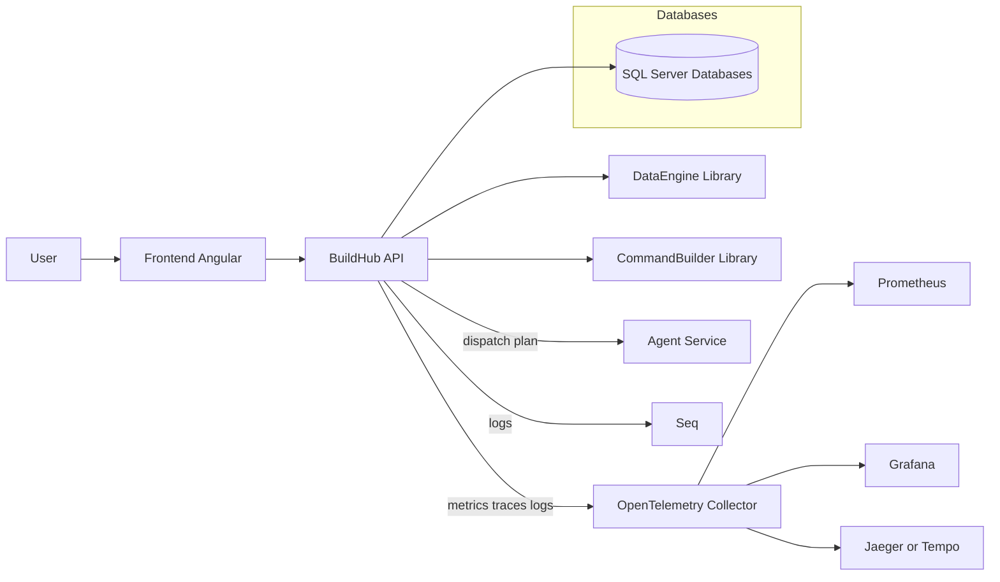
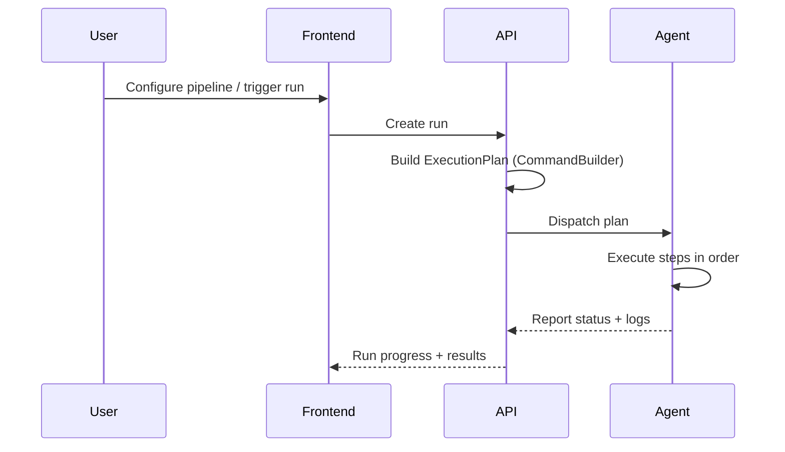
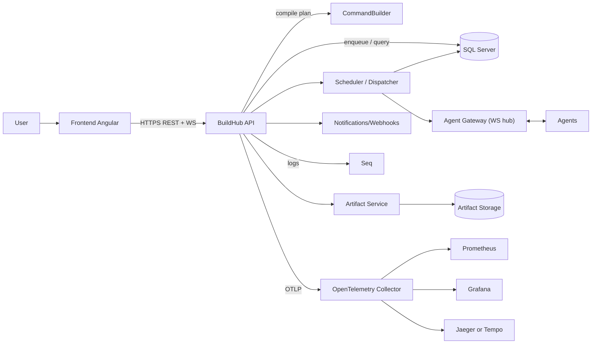

# Architecture

This describes the **current** repository structure and the **intended** end-state architecture.

## High-level components

- **Frontend (Angular)**: UI for managing builds, agents, pipelines, runs, and logs.
- **API (ASP.NET Core)**: REST API, OpenAPI documentation (Scalar), auth, orchestration.
- **CommandBuilder**: library that converts a build definition/context into an ordered set of executable steps.
- **Agents (planned)**: workers that pull or receive work and execute steps.
- **Databases**: Core data + Users + IntegrationTests DB projects.
- **Observability**: Serilog → Seq today; OpenTelemetry + Prometheus + Grafana planned.

## Component diagram

## “Happy path” flow

1. A user creates/edits a **pipeline definition** in the UI.
2. UI calls the API to store the definition.
3. When a run is triggered, API creates an **Execution Plan**.
4. The API dispatches the plan to an **Agent**.
5. The agent executes the steps (with retries/timeouts), producing logs/artifacts.
6. The API and agents emit telemetry (logs/metrics/traces).

## Notes from codebase (today)

- API uses OpenAPI + Scalar in Development (`/api-docs`), see `API/Startup.cs`.
- Logging is via **Serilog** and can be configured to send to Seq (see `Common/Logger`).
- CommandBuilder defines the core pipeline models: `ExecutionPlan`, `ExecutionStep`, policies, and command builders.

## Communication overview

See: [Communication](./communication.md)

At a high level:
- UI ↔ API: HTTPS REST + (optional) WebSocket for realtime updates
- API ↔ services: in-process workers first; later HTTP/gRPC or event-driven
- Services ↔ Agents: WebSocket via an Agent Gateway

## Planned services

See: [Planned services](./services.md)

The API can host these as internal modules first, and later split into services:
- Scheduler/Dispatcher
- Agent Gateway (WS hub)
- Artifact service
- Notification/Webhook service
- Reconciler/Maintenance jobs

## Considered features

See: [Feature catalog (considered)](./feature-catalog.md)

## Planned services diagram

This keeps the existing diagram above, but makes the **service split** explicit.

