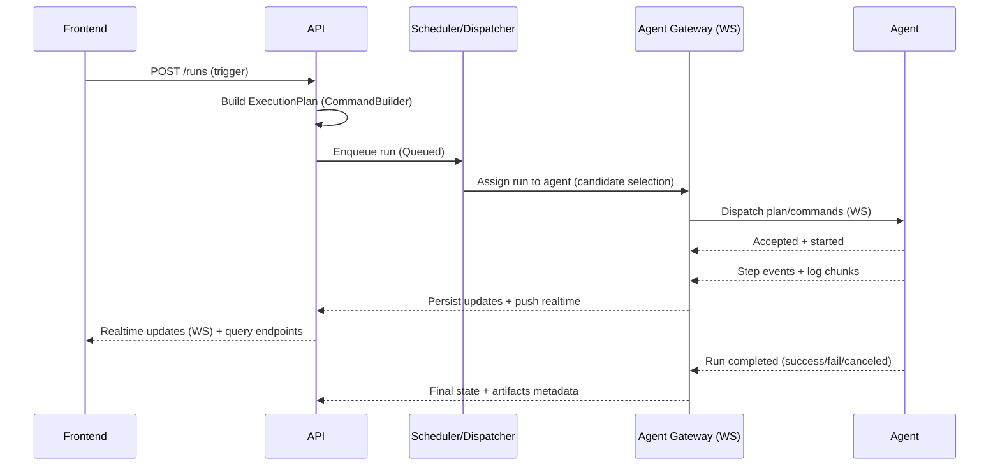
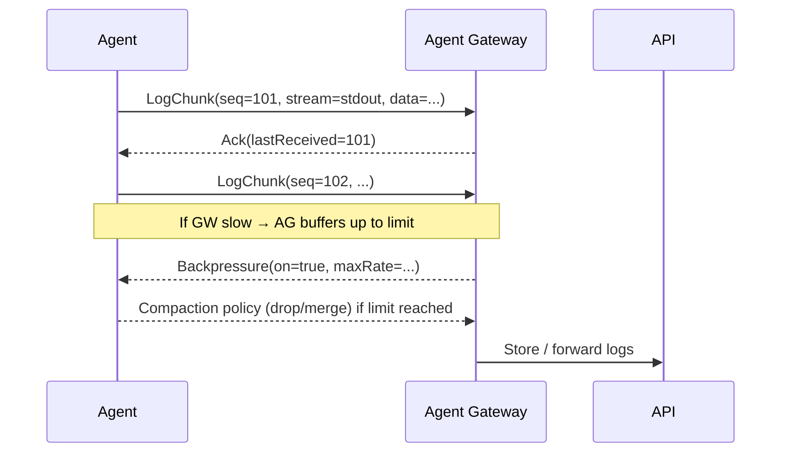

# Communication and protocols

> **Last updated:** 2026-02-15  
> **Navigation:** [Docs index](./README.md)

This document explains **how components talk to each other**:
- UI ↔ API
- API ↔ services
- services ↔ agents (WebSockets)
- where logs/metrics/traces flow

> This is intended to be concrete enough to guide implementation, while still allowing iteration.

## Channels at a glance

### UI ↔ API
- **HTTPS REST** for CRUD and queries (pipelines, runs, agents, users, settings).
- **WebSocket (or SignalR)** for realtime updates:
  - run/step state changes
  - live log tailing
  - agent online/offline

### API ↔ services
- Initially in-process workers are acceptable.
- If/when split:
  - internal **HTTP/gRPC** for commands (dispatch, cancel, queries)
  - optional event stream later for state changes

### Services ↔ Agents
- **WebSocket** (agent gateway) is the preferred channel for:
  - registration/hello
  - heartbeats
  - plan/command dispatch
  - status/log streaming
  - cancel/interrupt

### Telemetry
- **Logs:** Serilog → Seq
- **Metrics & traces:** OTLP → OTel Collector → Prometheus + Grafana, plus trace backend (Jaeger/Tempo)

---

## Recommended identifiers (correlation)
These IDs should exist everywhere (requests, messages, logs, telemetry):
- `runId` — the build/run identity
- `planId` / `planVersion` — what was executed
- `agentId` — which agent executed it
- `correlationId` — UI/API correlation per action (optional)
- `traceId` — distributed tracing id (W3C trace context)

**Rule of thumb:** every WS message includes `runId`, and every log line includes `runId` + `agentId` when applicable.

---

## Sequence: trigger run → dispatch → completion

---

## Sequence: log streaming with ack/backpressure (sketch)

---

## Cancel semantics
- UI calls `POST /runs/{runId}/cancel`
- Scheduler marks run as canceling/canceled
- Gateway sends `Cancel(runId, reason)` to agent
- Agent:
  - attempts graceful stop
  - then force-kills after timeout
  - reports final state

---

## Versioning strategy
- WebSocket messages include:
  - `protocolVersion`
  - `agentVersion`
  - `planVersion`
- API/gateway can reject incompatible agents with an “update required” reason.

## Related
- [Planned services](./services.md)
- [Pipeline](./pipeline.md)
- [Feature catalog](./feature-catalog.md)
