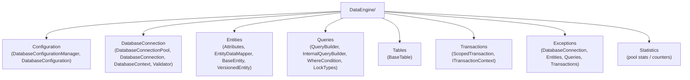
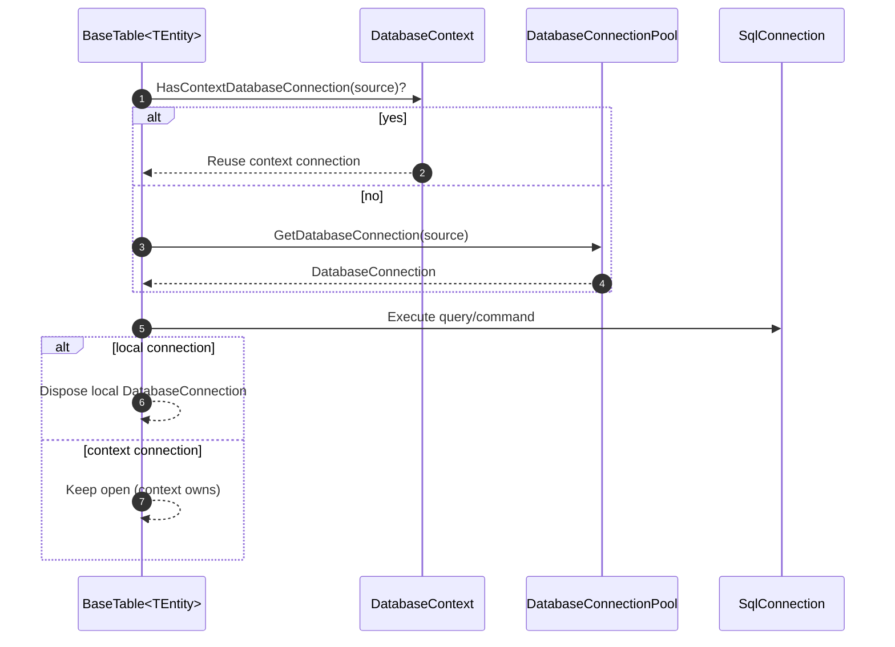
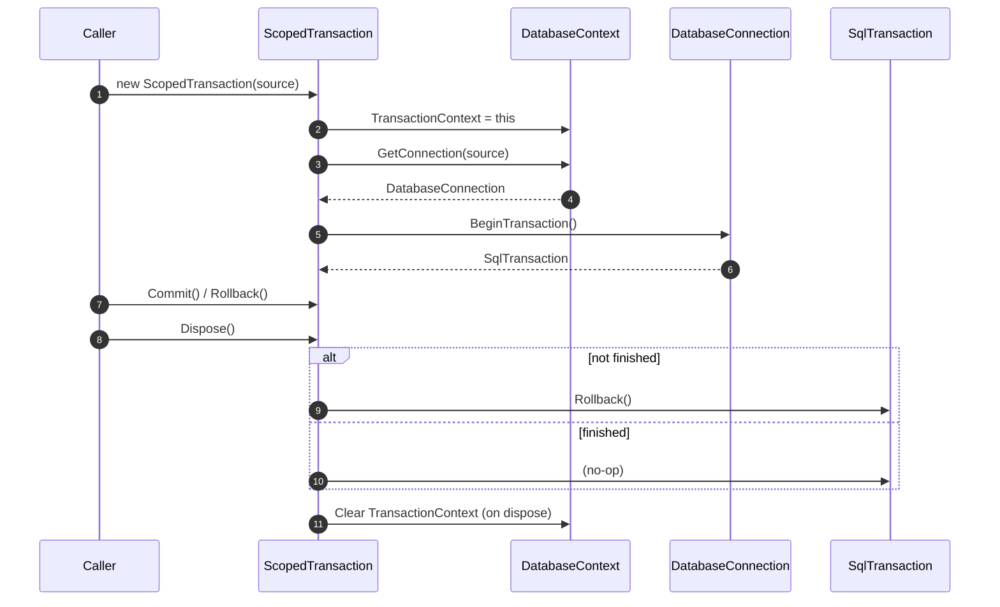

# DataEngine

BuildHub’s lightweight, explicit data-access layer for **SQL Server**.

Path: `DataEngine/`

DataEngine is intentionally **not** a full ORM. It focuses on a small set of primitives used across the solution:

- **Config-driven connection pooling** (`DatabaseConnectionPool`)
- **Thread/async-local connection context** (`DatabaseContext`) so multiple table calls can share the same connection
- **Scoped transactions** (`ScopedTransaction`) that auto-roll back if not committed
- **Attribute-based entity mapping** (`[TableName]`, `[ColumnInfo]`, `[PrimaryKey]`, `[Identity]`) + a reflection mapper (`EntityDataMapper`)
- A small **query builder** for WHERE/limits/locking (`QueryBuilder` / `InternalQueryBuilder`)
- A reusable **table base** for CRUD-style operations (`BaseTable<TEntity>`)

---

## Project structure



---

## How it fits in the solution

- **DataEngine** is a shared library (`BuildHub.DataEngine`) referenced by other backend projects to read/write SQL Server.
- The API (and tests) are responsible for providing configuration + connection strings. DataEngine then resolves:
  - pool sizing and retry behavior via `DatabaseConfigurations`
  - per-database connection strings via `ConnectionStrings` keys (mapped from `DatabaseSource`)

---

## Configuration

### Connection strings

`DatabaseSource` values map to connection-string keys using their `[Description]` attribute (see `DatabaseSource.cs`).

Example (shape):

```json
{
  "ConnectionStrings": {
    "BuildHubCore": "Server=...;Database=BuildHubCore;...",
    "BuildHubUsers": "Server=...;Database=BuildHubUsers;...",
    "BuildHubIntegrationTests": "Server=...;Database=BuildHubIntegrationTests;..."
  }
}
```

If you store connection strings outside source control, you can supply them via environment variables using the standard .NET mapping:

```
ConnectionStrings__BuildHubCore=Server=...;Database=BuildHubCore;...
```

### Pool settings

DataEngine also requires `DatabaseConfigurations` entries per `DatabaseSource` you plan to use:

```json
{
  "DatabaseConfigurations": [
    {
      "DatabaseSource": "Core",
      "MinPoolConnections": 5,
      "MaxPoolConnections": 10,
      "RetrieveConnectionTimeout": 5000,
      "RetrieveConnectionRetryCount": 3
    }
  ]
}
```

Behavior notes (current implementation):

- `MinPoolConnections` are created/opened during pool initialization.
- When the pool is exhausted, `GetDatabaseConnection(...)` waits/retries using:
  - `RetrieveConnectionTimeout`
  - `RetrieveConnectionRetryCount`
- Missing configuration entries throw `MissingDatabaseConfigurationException`.

---

## Core concepts

### 1) DatabaseConnectionPool

`DatabaseConnectionPool` is a singleton that owns pooled `DatabaseConnection` instances per `DatabaseSource`.

Typical usage is indirect (tables acquire/release connections automatically), but you can also retrieve a connection manually:

```csharp
DatabaseConnectionPool pool = DatabaseConnectionPool.GetInstance();

using DatabaseConnection conn = pool.GetDatabaseConnection(DatabaseSource.Core);
// use conn.InternalConnection (SqlConnection) to create commands if you need custom SQL
```

### 2) DatabaseContext (connection sharing)

`DatabaseContext` is a thread-local context that can hold active connections per `DatabaseSource`.

`BaseTable<TEntity>` uses this logic:

- If the current `DatabaseContext` already has a connection for the table’s `DatabaseSource`:
  - reuse it (so multiple calls share one connection)
- Otherwise:
  - borrow a connection from `DatabaseConnectionPool` and dispose it after the call

This allows you to run multiple operations in one logical scope without manually passing connections around.



### 3) ScopedTransaction (unit-of-work style)

`ScopedTransaction` is a wrapper that:

- associates itself with the current `DatabaseContext`
- starts a `SqlTransaction`
- automatically **rolls back** if disposed without `Commit()`

Example taken directly from the integration tests cleanup logic:

```csharp
using var tx = new ScopedTransaction(DatabaseSource.IntegrationTests);

var table = new IntegrationTestsTable();
foreach (var row in table.GetAll())
    table.Delete(row);

tx.Commit();
```



---

## Entities and mapping

Entities implement `IEntity`. The mapping layer uses attributes and reflection:

- `[TableName("...")]` — table name
- `[ColumnInfo("...")]` — column name
- `[PrimaryKey]` — marks the logical key (DataEngine uses this for “get by PK” helpers)
- `[Identity]` — marks an identity column (e.g., integer `ID`)

Example from tests (simplified):

```csharp
[TableName("INTEGRATION_TESTS")]
internal class IntegrationTestEntity : BaseEntity
{
    [ColumnInfo("NAME")]
    public string Name { get; set; } = string.Empty;
}
```

Mapping is performed through `EntityDataMapper` (with internal caching). If an entity property is not mapped to a column, calls like `GetAll()` can throw `MissingColumnDescriptionException` (see `IntegrationTestsTableTests`).

---

## Query building

For simple dynamic WHERE clauses, use `QueryBuilder`:

```csharp
QueryBuilder qb = new QueryBuilder()
    .Where(integrationTest, x => x.Guid); // builds WHERE [GUID] = @...

var row = integrationTestsTable.GetByCondition(qb);
```

The builder supports:

- WHERE conditions (`Where(...)`)
- optional locking hints (via lock type enums)
- row limiting / other builder state (see `QueryBuilderState`)

`InternalQueryBuilder` extends this and is used by `BaseTable<TEntity>` to generate SELECT/INSERT/UPDATE/DELETE statements.

---

## Tables and CRUD-style operations

Concrete table classes are typically tiny and inherit from `BaseTable<TEntity>`.

Example from `UnitTests/DataEngine/Common/IntegrationTestsTable.cs`:

```csharp
internal sealed class IntegrationTestsTable : BaseTable<IntegrationTestEntity>
{
    public IntegrationTestsTable()
        : base(DatabaseSource.IntegrationTests)
    {
    }
}
```

Common `BaseTable<TEntity>` operations (current implementation):

- `GetAll()`
- `GetByGuid(Guid guid)`
- `GetByCondition(...)` (expression or `QueryBuilder`)
- `Insert(TEntity entity)`
- `Update(TEntity entity)`
- `Delete(TEntity entity)`

Example test (real usage):

```csharp
var entity = new IntegrationTestEntity { Name = TestContext.TestName };

var table = new IntegrationTestsTable();
Assert.IsTrue(table.Insert(entity));

var dbEntity = table.GetByGuid(entity.Guid);
Assert.AreEqual(entity.Guid, dbEntity.Guid);
```

---

## Known sharp edges (current)

- **ThreadLocal context:** `DatabaseContext` uses `ThreadLocal<T>`. If you rely heavily on async/await with thread hopping, validate that context behavior matches expectations.
- **Configuration location:** the repo snapshot includes `DatabaseConfigurations` but may not include `ConnectionStrings` in source control; ensure runtime overrides are in place.
- **Portability:** this layer is built specifically around `Microsoft.Data.SqlClient` / SQL Server.

---

## Related docs

- [Architecture](architecture.md)
- [Pipeline](pipeline.md)
- [CommandBuilder](command-builder.md)
