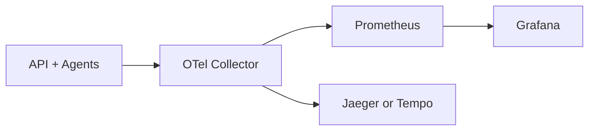

# Observability

## Today

### Logs

- Logging is implemented in `Common/Logger` via **Serilog**.
- Supported sinks (by config):
  - Console
  - Rolling file
  - Seq

The repo contains a minimal `docker-compose.yaml` with a Seq container.

> Note: `API/appsettings.json` currently has a likely typo for the minimum level key (`MinimumLogEventLevelLogLevel` vs `MinimumLogEventLevel`).
> The effective configuration is defined by `Common/Logger/LoggerConfiguration.cs`.

## Planned

### OpenTelemetry (OTel)

Goal: consistent **traces**, **metrics**, and **logs** across:
- Angular UI (frontend telemetry)
- API
- Agent services and background services

Planned stack:
- **OpenTelemetry Collector** (container) as the ingestion/processing layer
- **Prometheus** for metrics scraping/storage
- **Grafana** for dashboards
- Tracing backend under consideration:
  - **Jaeger**
  - **Grafana Tempo**

High-level data flow:



## What we’ll instrument first

- API request/response tracing + dependency calls
- Agent step execution spans (each `ExecutionStep` → span)
- Error tracking (still considering Sentry in the future)


## Example docker-compose (planned)

This is a **starting point** for local development (you will likely tweak ports and volumes):

```yaml
services:
  otel-collector:
    image: otel/opentelemetry-collector-contrib
    command: ["--config=/etc/otelcol/config.yaml"]
    volumes:
      - ./otel-collector-config.yaml:/etc/otelcol/config.yaml:ro
    ports:
      - "4317:4317"   # OTLP gRPC
      - "4318:4318"   # OTLP HTTP

  prometheus:
    image: prom/prometheus
    volumes:
      - ./prometheus.yml:/etc/prometheus/prometheus.yml:ro
    ports:
      - "9090:9090"

  grafana:
    image: grafana/grafana
    ports:
      - "3000:3000"

  jaeger:
    image: jaegertracing/all-in-one
    ports:
      - "16686:16686"
```
